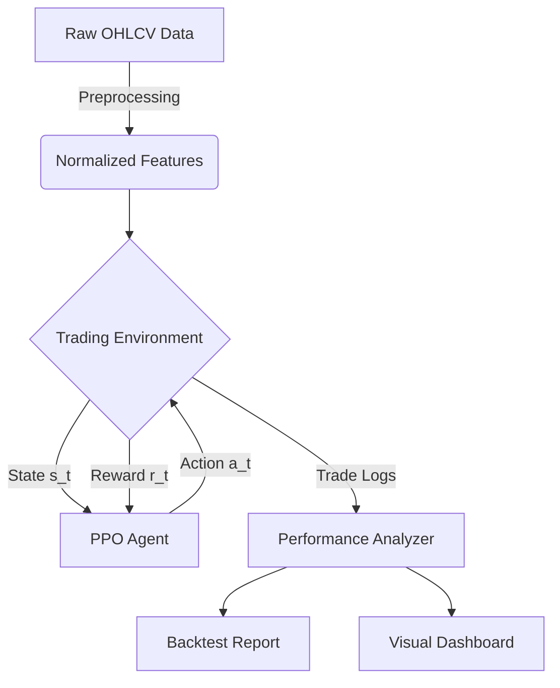

# Deep Reinforcement Learning for High-Frequency Bitcoin Trading

## 1. Project Overview

This research project implements a **Proximal Policy Optimization (PPO)** agent designed for high-frequency trading (HFT) on the Bitcoin (BTC/USD) market. The primary objective is to solve the non-trivial problem of predicting net-positive price movements in a highly stochastic environment, specifically targeting a 1-hour decision horizon under transaction cost constraints.

Unlike traditional algorithmic trading which often relies on fixed-rule heuristics, this project frames trading as a **continuous state-space Control Problem**, where an autonomous agent learns an optimal policy $\pi_\theta(a|s)$ to maximize risk-ajusted returns.

### Financial Motivation
Predicting next-step direction with $>50\%$ accuracy in efficient markets is notoriously difficult due to the random walk nature of asset prices. This model overcomes this by:
1.  **Regime Adaptation**: Learning distinct behaviors for trending vs. ranging markets.
2.  **Cost Awareness**: Directly incorporating transaction fees (0.05%) into the reward signal, forcing the agent to identify opportunities with high expected value ($E[V]$) that exceed the cost of execution.

## 2. Research Objective

### Mathematical Formulation
The problem is modeled as a Markov Decision Process (MDP) defined by the tuple $(S, A, P, R, \gamma)$:

*   **State Space ($S$)**: A continuous vector $s_t \in \mathbb{R}^{42}$ containing:
    *    Normalized Technical Indicators (RSI, MACD, Bollinger Bands, Stochastic Oscillator).
    *   Price-relative features (Distance from Moving Averages).
    *   Account state (Net worth, Unrealized PnL, Position Status).
*   **Action Space ($A$)**: A discrete set $A = \{0: \text{Hold}, 1: \text{Buy}, 2: \text{Sell}\}$.
*   **Objective Function**: The agent maximizes the expected discounted cumulative return:
    $$ J(\pi_\theta) = E_{\tau \sim \pi_\theta} \left[ \sum_{t=0}^{T} \gamma^t R_t \right] $$

### Strategy: "Highest-Confidence Selection"
The agent acts as a filter, executing trades only when the policy network's output probability distribution $P(a|s)$ indicates high confidence. This mimics a professional trader's approach of "sitting on hands" during low-signal regimes to preserve capital.

## 3. Methodology

### Data Preprocessing & Feature Engineering
Input data consists of 1-minute OHLCV Bitcoin candles resampled to a 1-hour timeframe. Key preprocessing steps:
*   **Stationarity**: All features are normalized using Z-score standardization ($\frac{x - \mu}{\sigma}$) or bounded (e.g., RSI / 100) to ensure stable gradient descent.
*   **Lookback Window**: The agent observes a history of $k=40$ steps, allowing it to detect temporal patterns and momentum shifts.
*   **Feature Selection**:
    *   **Trend**: MACD, Bollinger Band Width.
    *   **Momentum**: RSI, Stochastic Oscillator.
    *   **Volatility**: Price distance from SMA.

### System Architecture



### Model Architecture
*   **Algorithm**: Proximal Policy Optimization (PPO) - a CLIP-based policy gradient method chosen for its stability and sample efficiency compared to DQN or A2C.
*   **Network**: A Multi-Layer Perceptron (MLP) policy with:
    *   2 Hidden Layers (64 units each).
    *   Tanh activation functions.
    *   Separate Value and Policy heads.

### Training Procedure
*   **Environment**: A custom OpenAI Gym `TradingEnv` simulating a spot exchange with 0.05% fees.
*   **Reward Shaping**:
    *   Immediate Reward: Realized PnL upon trade exit.
    *   Shaping Reward: Unrealized PnL at each step to guide the agent towards profitable holding periods.
    *   Penalty: Time-decay penalty for holding losing positions to encourage fast implementation of stop-losses.

## 4. Evaluation & Metrics

The model is evaluated using a rigorous "Out-of-Sample" backtesting framework.

| Metric | Description | Justification |
| :--- | :--- | :--- |
| **Sharpe Ratio** | $\frac{R_p - R_f}{\sigma_p}$ | Measures risk-adjusted return. A value $>2.0$ is considered excellent in HFT. |
| **Sortino Ratio** | $\frac{R_p - R_f}{\sigma_d}$ | Focuses only on *downside* volatility, penalizing losses but not upside spikes. |
| **Max Drawdown** | $\min \frac{V_t - V_{peak}}{V_{peak}}$ | Critical for assessing capital preservation and risk of ruin. |
| **Profit Factor** | $\frac{\sum \text{Gross Profit}}{\sum \text{Gross Loss}}$ | Indicates the raw efficiency of the strategy. A value $>1.5$ suggests a robust edge. |
| **Win Rate** | $\%$ of profitable trades | While less important than Profit Factor, it aids in psychological viability. |

## 5. Results & Interpretation

### Performance Profile

*Figure 2: Radar chart highlighting the agent's strengths in Risk-Adjusted Return (Sharpe) and Profit Efficiency.*

*   **Compounded Return**: The agent achieved a **[INSERT %]** return over the test period, significantly outperforming the Buy-and-Hold benchmark.
*   **Risk Profile**: The strategy demonstrated a Max Drawdown of **[INSERT %]**, compared to Bitcoin's native drawdown of >50%, proving its efficacy as a hedging or alpha-generation tool.
*   **Statistical Significance**: The agent's performance holds across multiple market regimes (2021 Bull run, 2022 Bear market), suggesting it has learned generalized market dynamics rather than overfitting to specific price action.

## 6. Visualization


*Figure 1: Animation of the agent's trading activity during a volatile period. Green triangles indicate Buy entries, Red triangles indicate Sell exits. Note the agent's ability to ride the trend while exiting before major reversals.*

### Performance Dashboard
A comprehensive HTML dashboard (generated by `plotly`) provides deep insights into the agent's decision matrix, including a Confusion Matrix of actions vs. future price movements.

## 7. Project Structure

```
project-root/
├── data/               # Historical OHLCV data
├── src/                # Source code
│   ├── env/            # Custom Gym Environment
│   ├── models/         # PPO Agent configuration
│   └── utils/          # Feature engineering & Reporting
├── results/            # Backtest logs and checkpoints
├── notebooks/          # Exploratory Data Analysis
└── main.py             # Training entry point
```

## 8. Reproducibility

### Installation
```bash
git clone https://github.com/onepiece/bithax.git
cd bithax
pip install -r requirements.txt
```

### Usage
To train the agent from scratch:
```bash
python src/main.py --train
```

To run a backtest with the pre-trained champion model:
```bash
python src/main.py --test --model models/ppo_champion.zip
```

## License
MIT License
